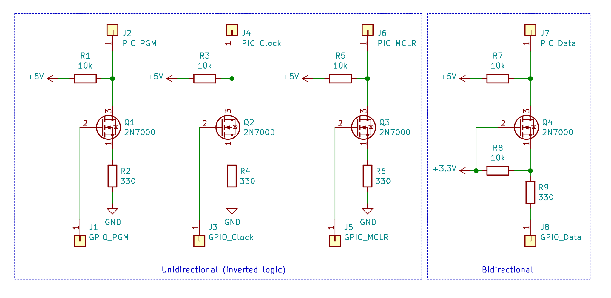

# gpio2pic

GPIO based in-circuit programmer/debugger for the PIC16F family.


## Build/Installation

Run `make` and then `sudo make install`.

`make firmware` can be used to re-build the debugger firmware.

### Dependencies
- libgpiod
- libreadline

## Configuration

After installation, the configuration file will be available at `/etc/gpio2pic.conf`.

This configuration file can be used to map GPIO pin numbers to the PIC pins.

By default, these GPIO/PIC pin associations are:
- Clock: GPIO 17
- Data: GPIO 27
- PGM: GPIO 5
- MCLR: GPIO 6

The PGM pin configuration can be ignored if using high-voltage programming.

Consider [Hardware suggestions](#hardware-suggestions) if using a Raspberry Pi and/or low-voltage programming.

### System GPIO configuration

If using a Raspberry Pi, it is optimal if the internal pull-up resistor is disabled for the pin associated with the PIC data line.

Below is a block that can be added to the `/boot/config.txt` file. It ensures that the pull-up is disabled for the data line, and that all lines default to output.

```
gpio=17=op,dh
gpio=27=op,pn,dl
gpio=5=op,dh
gpio=6=op,dh
```

## Usage

gpio2pic can be used interactively and non-interactively.

### Non-interactive HEX programming

Run `gpio2pic` with the hex filename supplied as the first argument.

### Interactive shell

Run `gpio2pic` and run `help` for a list of commands.

#### HEX programming

To program a hex file from the shell, the `hex <hex filename>` command can be run. The `hexstart <hex filename>` can also be used to program the firmware and begin execution within one command. 

For faster development, the `hexwatch <hex filename>` command provides automatic programming and execution restarts upon changes to the hex file.

#### Execution control

The `reset` command will set MCLR high. The PIC will be held in a reset state until the `start` command is run, which will set MCLR low. Execution occurs when MCLR is low.

#### Low-level interactive programming

Some commands are present to access low-level ICSP commands, if needed.

Entering/exiting programming mode is done with the `enterp` and `exitp` commands.

The `loadp`, `loadd` and `loadc` commands can be used to load a 14-bit word for the program, EEPROM data and configuration memory spaces, respectively.

Same thing for the `readp`, `readd` command, except they read memory already stored. `readp` should be used for reading from configuration memory (after executing `loadc` to switch to configuration memory space).

The `inc` command will increment the current address. `prog` will begin the erase/programming cycle for the current address. `prog_reset` will reset the current address.

When code protection is enabled, the `protected_erase` command can be used to erase all memory and disable code protection.

The `runbatch` command will load and execute a text file containing a list of gpio2pic commands, to be run in order.

### Debugger


gpio2pic includes a basic debugger firmware, and user interface. The debugger allows for setting breakpoints, single stepping, reading RAM and pausing execution. The debugger firmware is injected after programming the user firmware.

#### Firmware requirements

Preparations must be made in the user firmware, in order to be 'injectable'.

- 1 byte of RAM reserved at address 0x7f (for context saving the W register)
- 7 bytes of RAM reserved at address 0x20 (for debugger state and context saving the other registers)
- a NOP slide of 19 bytes at the top of the interrupt function
- Firmware must not exceed 0x1f50

This should be possible in both Assembly and C. An example in C is provided below.

#### Implementation in C (SDCC)

```
volatile __xdata __at (0x0020) char debug_mem1[7];
volatile __xdata __at (0x007f) char debug_mem2[1];

void Intr(void) __interrupt 0 {
  __asm__("fill 0x00, 19");

  ...
}
```

The `--stack-size 15` option should be passed to SDCC when compiling, so that 0x7f is available to reserve. SDCC usually uses 0x70 to 0x7f (stack size = 16) for 'stack' variables.

#### Operation

...image...

The `hexdebug <hex filename> <lst filename>` command be used to program the user firmware, inject the debugger firmware and start the debugger. While the lst filename parameter is optional, it is recommended for retrieving source code line numbers/text and showing the disassembled instruction during debugger execution.

The `debug <lst filename>` command can be used to start the debugger on a PIC already programmed/debugger injected. Again, the lst filename is optional.

During debugger execution, a different set of commmands are used. Execute `help` during debugging mode to see a list of commands.

The `readr <hex address>` command can be used to read from RAM.

There are two commands for setting breakpoints. The `break <hex address>` command will set a breakpoint for an address. If the lst file is provided, the `break_src <source file>:<line number>` command can be used to set a breakpoint for a source file/line number. After executing these commands, execution will resume.

The `next` command can be used to single step instructions. `continue` will resume execution, until the next breakpoint or a pause request from the user (CTRL-C).

When finished debugging, use `exit` to exit debugging mode.

#### Debugger injection internals


The debugger firmware is located at 0x1F50. During injection, gpio2pic will attempt to find a NOP slide of at least 19 bytes, near the beginning of the interrupt. When found, the code located between 0x0004 and the start of the NOP slide is shifted forward by 19 bytes. This leaves 19 bytes for the debugging pre-execution bootstrap, at address 0x0004.

The bootstrap will contain logic for saving/restoring the state of the W, STATUS, PCLATH and FSR registers and starting the debugger.

#### Debugger communication internals


## Hardware suggestions

This was tested on a Raspberry Pi Zero and a PIC16F876.

### Level shifting schematic

